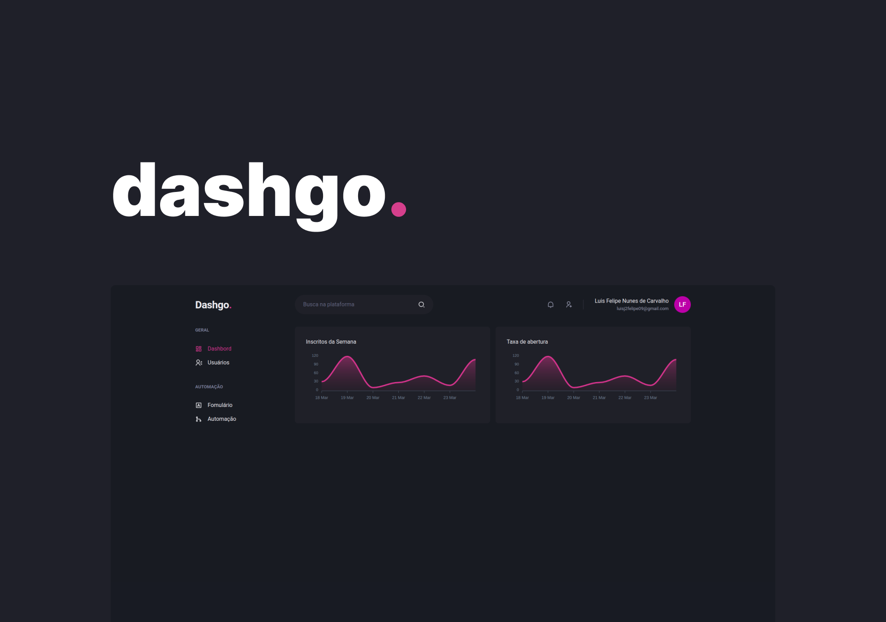

<h1  align="center">
    
</h1>

<p align="center">
  
  
  
</p>

<h4 align="center"> 
	✔️ 🚀 Concluido  ✔️
</h4>

<p align="center">
 <a href="#Tecnologias">Tecnologias</a> |
 <a href="#Getting-started">Iniciar projeto</a> |
 <a href="#autor">Autor</a>
</p>





## Tecnologias

Este projeto usou as seguinte tecnologias:

- NextJS
- Chakra UI
- Mirage
- React hook forms
- React Query


## Iniciar projeto

Clone e projeto e entre na pasta.

```bash
$ git clone https://github.com/Luis-Felipe-N/dashgo..git
$ cd dashgo.
```

Siga os passos abaixo: 
```bash
# Instale as dependencias
$ yarn
$ npm install

# Iniciar projeto
$ yarn start
$ npm start
```
Este projeto estará acessível em http://localhost:3000

## Autor
---


<p align="center" >Feito com ❤️ por Luis Felipe</p>
